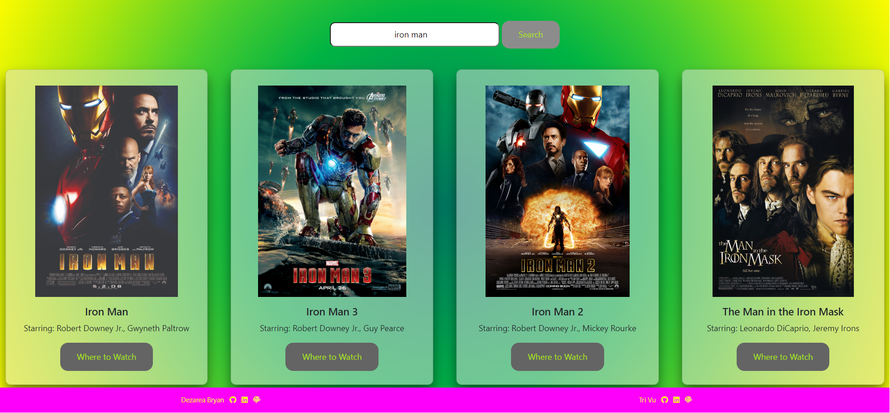
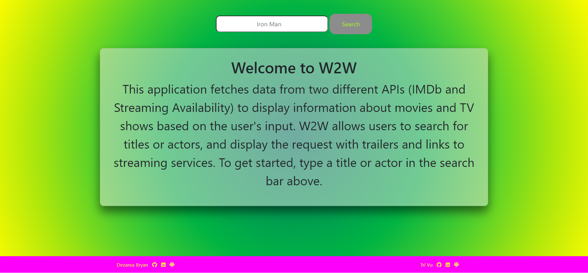
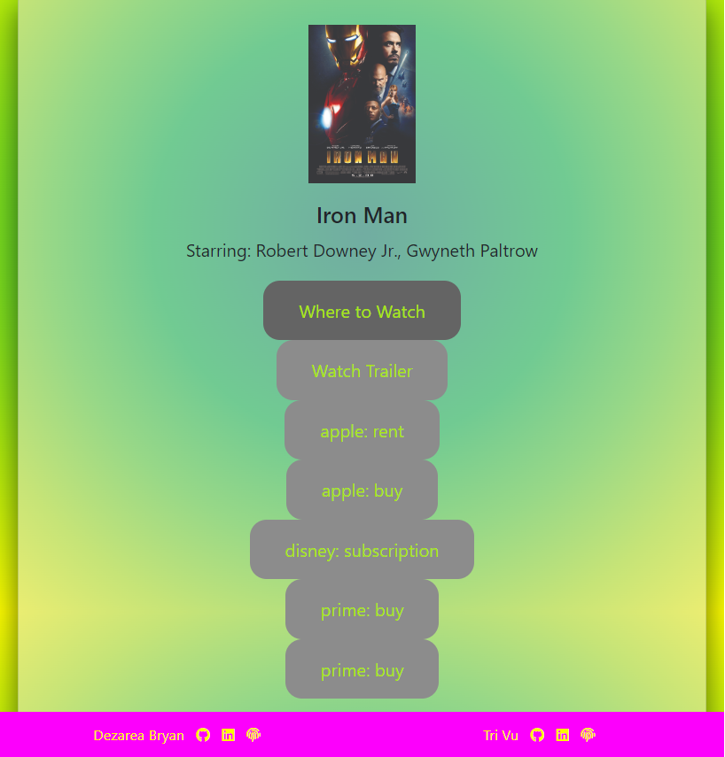
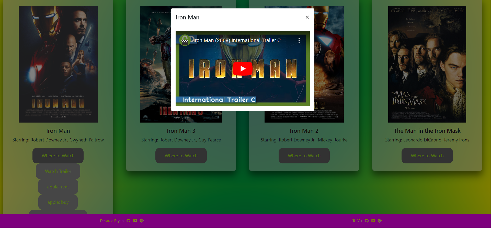

<h1 align="center">W2W</h1>

<h2 align="center"> Search movie titles, watch the trailer, and find out where to watch! </h2>

---

##Live Sites 
---

##What It Is
---
W2W is an application that fetches data from two different APIs (IMDb and Streaming Availability) to display information about movies and TV shows based on the user's input. W2W allows users to search for titles or actors, and display the request with trailers and links to streaming services. To get started, type a title or actor in the search bar above.

This project was a colaboration between Dezarea Bryan and Tri Vu.

##Tech Stack
---
  * Vanilla JS
  * HTML
  * Bootstrap
  * CSS3

##MVP (Minimum Viable Product)
---  
The MVP included:
  * Allowing the user to search movies, tv shows, and actors
  * Searching resets the DOM rather than continuously appending
  * User can watch the trailer without leaving the app
  * Trailer stops playing on close
  * Disabling the Where to Watch button after the initial click
  * A mobile responsive design

##Screenshots
---

